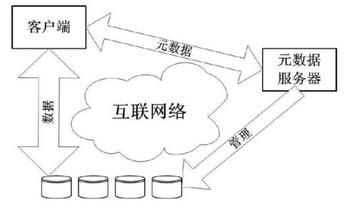

# 静态资源
静态资源包括图片、压缩文件等。这些文件比网页文件来大的多，直接拖慢网页响应速度。所以将一些公共的资源提取统一管理，以后想更新某些公共的资源图片也不需要全部修改，直接在一处服务器修改即可。同时也能避免遗漏。
#### 静态资源统一管理：

###### 1.压缩资源图片。尽量减少资源体积，提高加载速度。
###### 2.如果带宽影响到了访问加载速度，可以增加带宽，而不需要所有服务都增加。
###### 3.使用cdn加速。cdn核心理念就是将内容缓存在终端用户附近，使用户能够就近访问到资源，例如采用缓存的机制。

###### 4.统一替换资源图片快捷方便，不会有遗漏。

#### 內容补充：
###### 什么是CDN？
###### CDN的全称是Content Delivery Network，即内容分发网络。其目的是使用户可就近取得所需内容，解决 Internet网络拥挤的状况，提高用户访问网站的响应速度。CDN网络可以将服务器的内容缓存到分布全球的CDN节点，根据用户的访问IP，就近连接CDN，提高网站响应速度。

